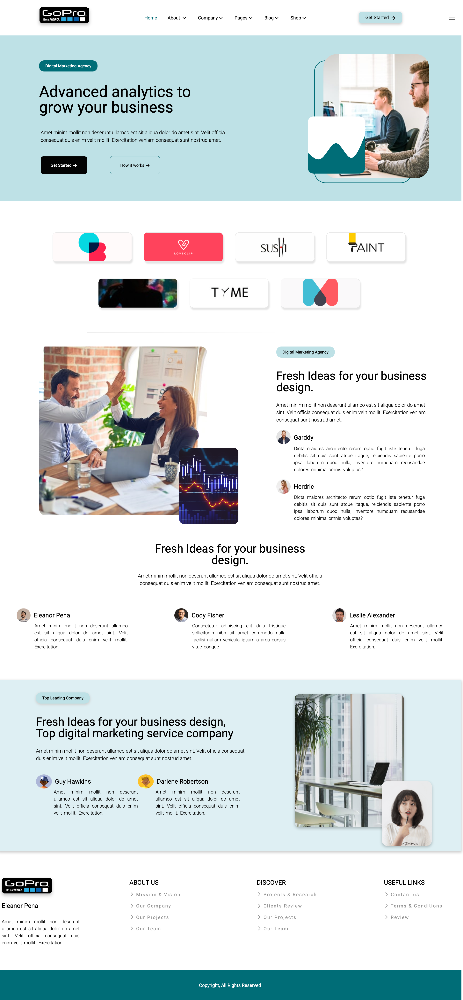

# figma-to-flexbox

## Few words about the project!

This is my first design implementation project. I found an inspiration [here](https://www.figma.com/proto/aMvbeKbiTn0LxDDWs1mnDH/Landing-Page-Design%2C-Home-Page-Design%2C-Web-Page-Design-(Community)?node-id=2-3) and used HTML and CSS to build it. 

## To do:

It is necessary to make a website responsive so I need to work on it! 

## Take a look!

